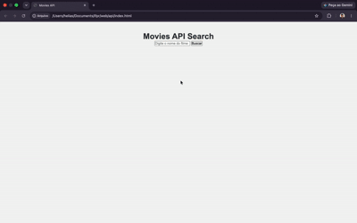

## 🎬 Busca de Filmes

Projeto de estudo desenvolvido com **HTML, CSS e JavaScript puro**, que consome a [OMDb API](https://www.omdbapi.com/) (API pública listada em [public-apis](https://github.com/public-apis/public-apis)) para buscar informações de filmes a partir de um campo de texto.

## 📌 Sobre o projeto

O usuário digita o nome de um filme em um campo de busca e, ao clicar no botão, a aplicação faz uma requisição para a OMDb API e exibe na tela:

- Título e ano de lançamento
- Pôster do filme
- Gênero
- Diretor
- Sinopse

## 🚀 Tecnologias utilizadas

- HTML5
- CSS3
- JavaScript (vanilla, sem frameworks)
- [OMDb API](https://www.omdbapi.com/) para os dados dos filmes

## 📁 Estrutura do projeto

```
├── index.html
├── style.css
└── script.js
```

## ⚙️ Como executar

1. Clone este repositório:
   ```bash
   git clone https://github.com/heliastorres/project-movies-api.git
   ```

2. Obtenha uma API key gratuita da OMDb em [omdbapi.com/apikey.aspx](https://www.omdbapi.com/apikey.aspx)

3. Abra o arquivo `script.js` e substitua o valor da variável `apiKey` pela sua chave:
   ```javascript
   const apiKey = "SUA_KEY";
   ```

4. Abra o arquivo `index.html` no navegador (não precisa de servidor).

## 🎥 Demonstração



## 📚 Contexto acadêmico

Projeto desenvolvido como atividade da disciplina, com o requisito de utilizar uma API pública da lista [public-apis](https://github.com/public-apis/public-apis).

## 📄 Licença

Projeto criado para fins educacionais.
